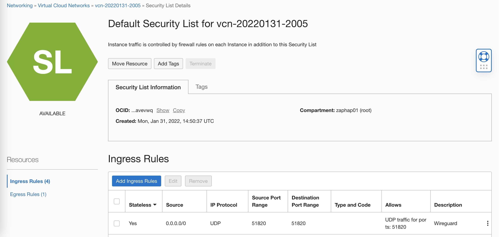

# scripts

A list of useful scripts to make your terminal life easy.

Tried and tested in Ubuntu & MacOS.

If you are facing any problems, you can reach out to me on zuman.one@icloud.com

<br>

## Table of Contents
- [1. Container Wrappers](#1-container-wrappers)
- [2. Home directory customization](#2-home-directory-customization)
- [3. zsync to sync files between local and server](#3-zsync-to-sync-files-between-local-and-server)
- [4. VPN Initialization script](#4-vpn-initialization-script)
- [5. Docker based Ubuntu VM](#5-docker-based-ubuntu-vm)


<br>

## 1. Container Wrappers

### 1.1. Nginx Proxy Manager

### 1.2. Portainer with [reverse-proxy](https://github.com/zuman/common-proxy)

### 1.3. Nextcloud initialization command with [reverse-proxy](https://github.com/zuman/common-proxy)

1. Setup  [Home directory customization](#1-home-directory-customization)
2. Run the command: `./containers/nextcloud/nc-setup.sh`

## 3. Home directory customization

### Commands to setup home directory.
```
./home/setup.sh
source ~/.profile
```

<br>

## 3. zsync to sync files between local and server

### Prerequisites:
    1. Complete section above : 1. Home directory customization
    2. Create a ssh profile in ~/.ssh/config file as below (Use your own details):
        Host syncserver
            Hostname server.com
            User username
            Port 22
            IdentityFile ~/.ssh/id_rsa
    
    3. Make sure the directory ~/zsync/syncdir exists and is writable at server and in local machine.


### Usage:
```
zsync [pull|push] syncserver syncdir
```

<br>

## 4. VPN Initialization script

### From home/packages.sh, copy and run the following sections:
> Setup Docker

> Net tools

### Run the following commands to initialize VPN:
```
cd vpn
./setup.sh
sudo reboot
```
### Confirm that wireguard is running:
```
cd /opt/wireguard-server
docker-compose ps
```
### Add the following ingress rules to your firewall:


### Install Wireguard client on your device:
https://www.wireguard.com/install

### Show QR code for the VPN peer:
>docker exec -it wireguard /app/show-peer 1

<br>

## 5. Docker based Ubuntu VM

1. Run the below commands. (make sure to replace your username and password accordingly)

>cd vm
 
>docker build . -t vm --build-arg username=myuser --build-arg password=mypassword

2. cd into the directory where you want the home directory of the user.
2. Run the container with command
>docker run -d -v .:/home --network host --name my-vm vm

<br>
